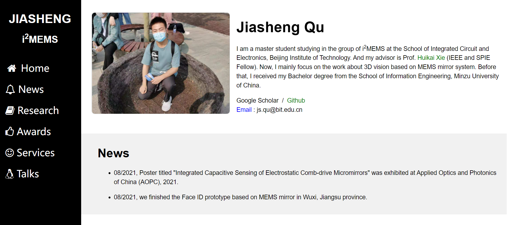

# 1. About academic homepages

During my studying, I noticed many scholars have their own homepages to list their past projects and work. People can easily  know about their work and have better discussion. I just got the drive to design and realize my personal homepage suddenly, even without any web programming experience before. Even till finished, I still don't know how it works. However, the homepage of mine just was realized. So, homepage making is simple and fun. 

For me, it is just like markdown or Latex. What we need is to design the layout and fill the  contents. And I  finished it with less than 2 days. So if you have the thought of personal homepage making, just do it.

# 2. What you need

Academic homepages realization from zero can be kind of difficult. To build it fast and easily, you need

+ Templates
+ Frameworks
+ Combinations

I got my homepage referring to the work of [Wang's](https://www.wangyunhe.site/) and [Li's](https://li-chongyi.github.io/). Thanks so much to them. The framework I used is [w3.css](https://www.w3schools.com/w3css/default.asp) , which is a modern, responsive, mobile first CSS framework. Demos and templates in its tutorial can help you bulid your academic homepage easily.  What you need is to combine them together to create your beautiful work. Also, the website widget for page view counter is  [ClustrMaps](https://clustrmaps.com/).

# 3. Notes

If my design can inspire or help you, give me a shining star. :star:	:star2: Thank you so much! :smile:

Also, if you have the interests in what I am doing, about 3D vision, please contact me by email.  

